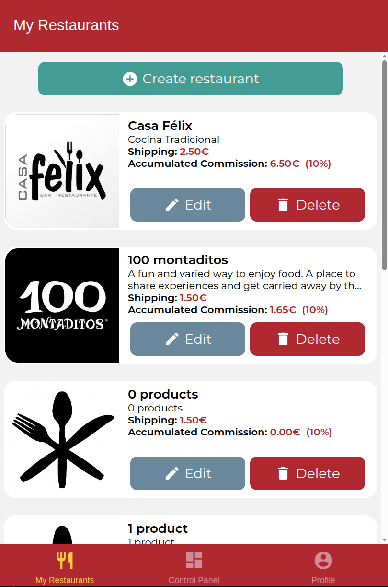
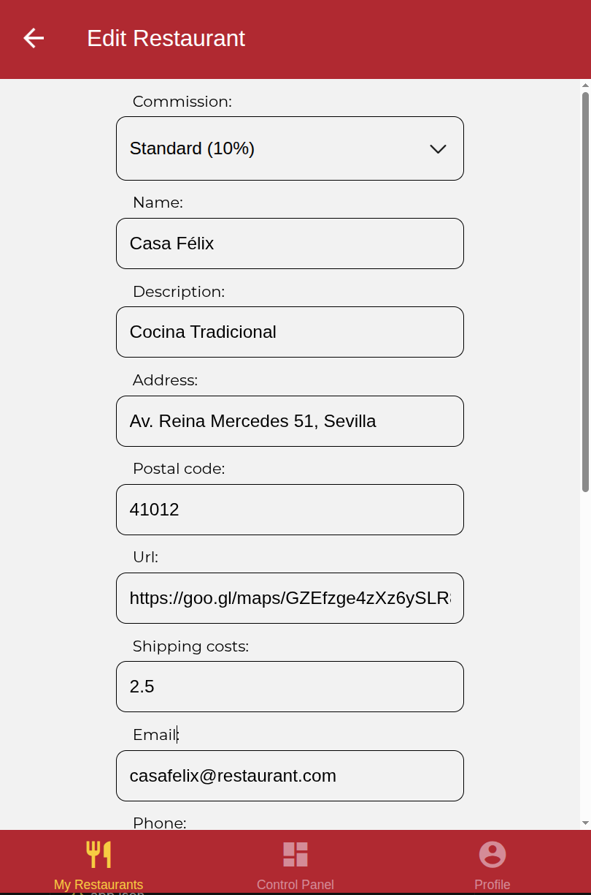
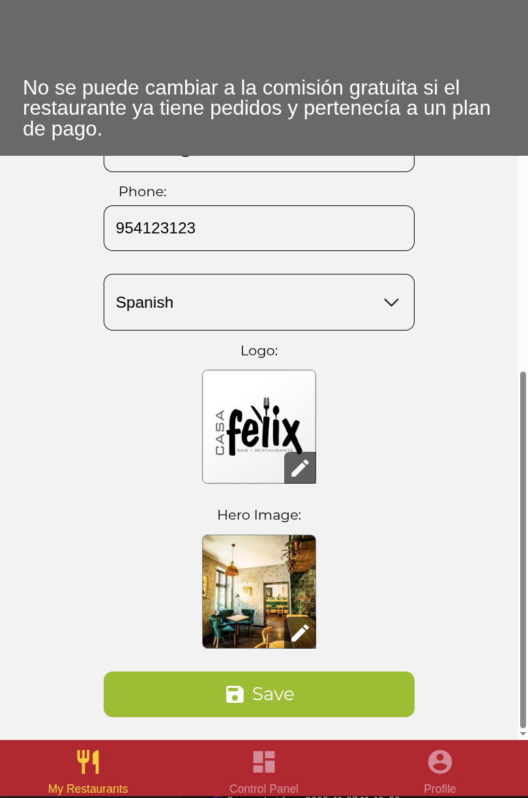

# Examen DeliverUS Frontend - Modelo F - Gestión de Comisiones de Restaurantes

Recuerde que DeliverUS está descrito en: <https://github.com/IISSI2-IS>

## Enunciado del examen - Frontend Owner

Se ha implementado un sistema de **Gestión de Comisiones sobre Pedidos** en el backend. Su tarea es implementar la interfaz frontend necesaria para que los propietarios de restaurantes puedan visualizar y asignar comisiones a sus restaurantes.

### El Requisito de Negocio

El backend ya proporciona:

1. **Tipos de Comisión**: Existen diferentes tipos de comisión:
   - **Comisión Gratuita (0%)**: Sin costo
   - **Comisión Estándar (10%)**: Comisión sobre los pedidos
   
2. **Comisión Acumulada**: Para cada restaurante se puede consultar la suma total de todas las comisiones aplicadas a sus pedidos.

3. **Restricciones**:
   - Un propietario solo puede tener **un restaurante** con comisión gratuita.
   - Si un restaurante ya tiene pedidos y no pertenece al plan gratuito, no se puede cambiar a dicho plan.

### Datos de Comisión

Para cada restaurante, el backend devuelve en `GET /users/myrestaurants`:
- `commission` (object): Información de la comisión asignada
  - `id` (number): Identificador de la comisión
  - `name` (string): Nombre de la comisión
  - `percentage` (number): Porcentaje de comisión a aplicar
- `commissionId` (number): Identificador de la comisión asignada

### Ejercicios: Requisitos Funcionales del Frontend

#### **Ejercicio 1: RF1. Mostrar Comisión Asignada en Listado de Restaurantes**

**Pantalla**: `RestaurantsScreen.js`

**Requisitos**:

- Mostrar la **comisión asignada** del restaurante (**2 puntos**):
  - Mostrar el porcentaje de comisión entre paréntesis (ej: `(10%)`).
  - Si no hay datos disponibles, mostrar `(N/A)`.

- Fidelidad estética (**0,5 punto**).

---

#### **Ejercicio 2: RF2. Mostrar Comisión Acumulada en Listado de Restaurantes**

**Pantalla**: `RestaurantsScreen.js`

**Requisitos**:

- Mostrar la **comisión acumulada** del restaurante (**3 puntos**):
  - Label: `Accumulated Commission:`
  - Mostrar el valor acumulado en formato moneda con 2 decimales (ej: `125.50€`).
  

- Fidelidad estética (**0,5 punto**).


*Listado de restaurantes con RF1 y RF2:*

---

#### **Ejercicio 3: RF3. Asignar Comisión desde Formulario de Edición**

**Pantalla**: `EditRestaurantScreen.js`

**Requisitos**:

- Agregar un **dropdown para seleccionar la comisión** (**2,5 puntos**):
  - Label: "Commission:"
  - Mostrar todas las comisiones disponibles con formato: `Nombre (Porcentaje%)`
  - Ejemplo: "Gratuita (0%)", "Estándar (10%)"
  - La comisión es un campo **obligatorio** en el formulario.

- Fidelidad estética (**1,5 punto**).


*Formulario de edición incluyendo el selector de comisión:*


*Error al intentar establecer comision:*



---

## Endpoints API Disponibles

### GET /users/myrestaurants

Devuelve lista de restaurantes del propietario autenticado **incluyendo la información de comisión asignada**.

**Response**:

```json
[
  {
    "id": 1,
    "name": "Mi Restaurante",
    "description": "Descripción del restaurante",
    "commission": {
      "id": 2,
      "name": "Estándar",
      "percentage": 10
    },
    "commissionId": 2,
    // ... más campos
  }
]
```

### GET /commissions

Devuelve lista de todas las comisiones disponibles.

**Response**:

```json
[
  {
    "id": 1,
    "name": "Gratuita",
    "percentage": 0
  },
  {
    "id": 2,
    "name": "Estándar",
    "percentage": 10
  }
]
```

**Acceso**: Solo usuarios autenticados con rol `owner`.

### GET /restaurants/:restaurantId/commission

Devuelve la comisión acumulada de un restaurante específico.

**Response**:

```json
{
  "totalCommission": 125.50
}
```

### PUT /restaurants/:restaurantId

Actualiza un restaurante. Ya incluye soporte para `commissionId` en el payload.

**Request**:

```json
{
  "name": "Nuevo Nombre",
  "commissionId": 2,
  // ... otros campos
}
```

**Response (éxito - 200)**:

```json
{
  "id": 1,
  "name": "Nuevo Nombre",
  "commissionId": 2,
  // ... más campos
}
```

**Response (error - 409 Conflict)**:

```json
{
  "code": 409,
  "message": "You cannot change to free commission. This restaurant has orders."
}
```

---

## Preparación del Entorno

### a) Windows

```bash
npm run install:all:win
```

### b) Linux/MacOS

```bash
npm run install:all:bash
```

## Ejecución

### Backend (en una terminal)

```bash
npm run start:backend
```

### Frontend (en otra terminal)

```bash
cd DeliverUS-Frontend-Owner
npm start
```


## Procedimiento de entrega

1. Borrar la carpeta **node_modules** de frontend y backend.
2. Crear un ZIP que incluya todo el proyecto. **Importante: Comprueba que el ZIP no es el mismo que te has descargado e incluye tu solución**
3. Avisa al profesor antes de entregar.
4. Cuando el profesor te dé el visto bueno, puedes subir el ZIP a la plataforma de Enseñanza Virtual. **Es muy importante esperar a que la plataforma te muestre un enlace al ZIP antes de pulsar el botón de enviar**. Se recomienda descargar ese ZIP para comprobar lo que se ha subido. Un vez realizada la comprobación, puedes enviar el examen.
